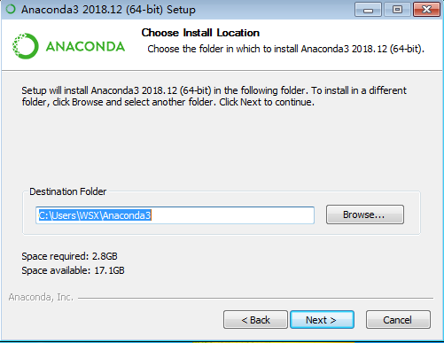
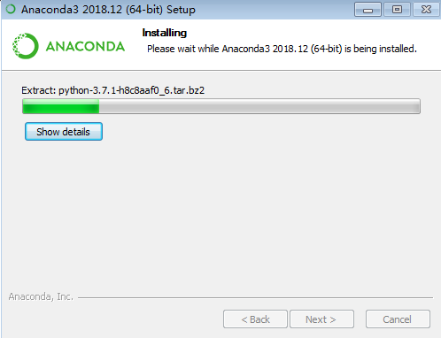

\mainmatter

# 第1章 Python介绍及学习前的准备 {#intro}

**本章内容提要**:

- Python是什么
- 为什么要使用Python进行数据分析
- 科学计算核心库简介
- 软件安装与配置

本书在正式向读者介绍Python的基本语法与操作之前，通过本章向读者简要介绍Python的定义与利用Python进行数据处理的优势，详述学习Python之前相关软件的安装与配置。

## 1.1 Python是什么

在IEEE发布的2017年编程语言排行榜中，**Python高居首位**。对于这样一门流行的编程语言，很多的Python入门图书都给它进行定义，但本书作者认为，较为清晰明了的定义来自维基百科：

> Python是一种广泛使用的高级编程语言，属于通用型编程语言，由吉多·范罗苏姆创造，第一版发布于1991年。Python可以被视之为一种改良(加入一些其他编程语言的优点，如面向对象) 的LISP。作为一种解释型语言，Python的设计哲学强调代码的可读性和简洁的语法（尤其是使用空格缩进划分代码块，而非使用大括号或者关键词）。相比于C++或Java，Python让开发者能够用更少的代码表达想法。无论是小型还是大型程序，Python都试图让程序的结构清晰明了。

这段文字囊括了读者需要了解的关于Python的基本信息。

1. Python目前被广泛使用。
2. Python属于高级编程语言，这区别于C语言这样的中级语言或是底层的硬件编程、汇编等语言。
3. Python由吉多·范罗苏姆创造，于1991年发布。
4. Python支持面向对象编程（Object-Oriented Programming，OOP）。
5. Python属于解释型语言，解释型语言以文本的方式存储程序代码，不需要在运行前进行编译（为大众所熟知的C语言就不是解释型语言，在运行前必须编译为机器识别的语言）。
6. 强调代码的可读性和简洁的语法是Python的设计哲学，这一点尤其需要注意和理解，因为这是Python在形式上最有别于其他编程语言之处。Python使用空格的缩进来划分不同的代码块，其他一些常见语言一般使用大括号或者关键字，正是这个特点，让Python代码无论大小长短都看起来非常简单清晰，易于使用（读者将会在本书学习的过程中深入理解这一特点）。

T> 了解一门语言的历史和特点有助于提升读者对其语法的理解和快速应用能力。读者有闲暇不妨通过搜索引擎查查Python设计的初衷和一些Python开发的著名项目。

## 1.2 为什么要使用Python进行数据分析

在成为数据分析和人工智能等领域的头号选手之前，Python早就因其大量的Web框架、丰富的标准库以及众多的扩展库等特点成为网络建站、系统管理、信息安全等领域的热门方案。例如，有名的豆瓣网站就是基于Python开发，Linux所有的发行版都默认安装了Python。

近年来，Python的科学计算库（如结构化数据操作库Pandas、机器学习库scikit-learn）不断进行改良，使得利用Python来进行数据分析成了优选方案。Python还有一个“胶水语言”的外号，这来源于它能够非常轻松地集成C、C++等底层代码，进行计算优化。与SAS和R等分析建模领域特定编程语言相比，Python可以同时用于项目原型的构建和生产（前者则主要用于项目原型的构建），从而避免了使用多个语言的麻烦。加上Python本身多年来不断提升的强大编程能力，用户只需要使用Python就可以完成以数据为中心的建模、分析与应用。

可以说，Python在数据分析领域的迅猛发展与其本身非常成熟且广泛应用是分不开的，Python开源、简明易用的特点也让开发者和使用者自觉倾注精力共同维护社区环境，构建了整个Python计算分析领域的良好生态。

## 1.3 科学计算核心库简介

Python拥有着众多的软件包/库，本书难以全部涉及，这里仅介绍几个构成Python科学计算生态系统的核心“成员”。

* NumPy：NumPy是Numerical Python的简称。NumPy是Python科学计算最基础的库，基本上涉及数据分析的软件包都基于它构建。
* Pandas：Pandas的名字来源于Python数据分析（Python data analysis）和面板数据（panel data）的结合。该库提供了多个数据存储对象，其中的DataFrame对象可以表征数据分析常见的二维表格。除此之外，它还提供了非常多便捷处理结构化数据的函数。
* Matplotlib：Matplotlib起源于矩阵实验室MATLAB中的绘图函数，是Python中非常流行的绘图库，可以轻松进行二维数据甚至多维数据可视化。
* SciPy：SciPy库提供了一组专门用于科学计算中各种标准问题包，如数值积分、微分、信号处理、统计分析，它与NumPy的结合可以处理诸多科学计算问题。
* Jupyter：Jupyter是一个交互和探索式计算的高效环境。其中两个组件较为常用，一是IPython，用于编写、测试和调试Python代码；二是Jupyter Notebook，它是一个多语言交互式的Web笔记本，现在支持运行Python、R等多种语言，Jupyter Notebook中代码与Markdown的结合可以创建良好、可重复的动态文档。这也是读者进行Python数据分析的学习环境。

## 1.4 搭建环境

Python存在Python2（现在一般指Python2.7）和Python3（现在一般指Python3.5及以上）两个不同的大版本。Python官方宣布将于2020年停止Python2的更新和维护，全面进入Python3时代。考虑到学习和应用的普适性，本书的介绍以Python3版本为基础。

目前流行的Python集成开发环境（IDE）有很多，如PyCharm、Sublime Text、Eclipse+PyDev和Anaconda中的Spyder。不同的软件、系统的安装和配置方式各不相同，本书使用Anaconda平台的Jupyter Notebook对Python进行介绍。Anaconda是非常强大的跨系统开源计算平台，支持个人PC使用的Windows、Linux和macOS，提供的近1000个开源软件包基本上可以满足个人或团队进行数据处理的需求。

为了满足不同读者的需求，本书介绍两种Python线上平台、以及本地机器环境下相关软件的安装和配置，读者可任意选择使用。

### 1.4.1 线上平台

网络上现在有很多在线的Python解释器，读者可以在计算机有网络服务的情况下通过浏览器运行代码。因为软件包的导入和计算都在服务器端，所以读者不需要较高配置的计算机就能进行Python的学习和数据分析。

本书推荐两个免费的Jupyter Notebook网站，读者可结合自己计算机的配置和网络情况进行选择。

1. Jupyter官方提供的Try Jupyter网站 （<https://jupyter.org/try>），该网站包含学习在Jupyter中使用Python和文本书写的例子和练习，读者可以在Try Python with Jupyter的主页（在Try Jupyter网站选择使用Python）运行、调试代码，并下载Jupyter笔记本到本地存储。


I> 因为写作的时间和读者阅读本书的时间不同，页面的样子有可能更改，甚至失效，如果存在这样的问题，请访问Jupyter的官网（<https://jupyter.org/>）进行阅读和查找。

2. 微软公司提供的Jupyter数据探索学习平台Azure（<https://notebooks.azure.com/>），如图1-2所示，支持在线运行多种编程语言进行数学科学探索，其中比较常用的是Python和R。读者可以通过微软账户创建仓库，新建Jupyter Notebook并书写代码和探索数据，完成后可以保存、与他人分享（使用过GitHub等开源仓库的读者会发现这个平台的操作和它们极为相似）。


本书作者推荐读者使用Azure平台，因为其在创建、使用、保存与分享方面占有优势，不过读者首先需要创建一个微软账号。

T> 随着时间的推移，相信会有越来越多的线上Jupyter Notebook平台，感兴趣的读者不妨搜索汇总并选择最适合自己学习和使用的平台。

### 1.4.2 本地机器环境下相关软件的安装

读者如果想要在本地部署学习环境，那么可以选择安装两款软件。第一款软件是上文已经提到的Anaconda，其为必需软件；第二款软件为nteract（<https://nteract.io/>），见图1-3，为可选软件。与Anaconda默认提供的Jupyter Notebook不同，nteract像我们常用的文字编辑器一样，界面非常简洁酷爽，可以非常方便地编辑Jupyter Notebook文件（文件扩展名为“.ipynb”）。本书作者推荐读者使用nteract，本书后续的代码和文档展示都会使用到它，虽然nteract目前只有alpha版本（测试版），功能还在不断完善中，但是这不会影响读者使用它学习Python。其实，由于Jupyter Notebook与nteract运行Python都是基于IPython内核ipykernel，除了界面、显示效果和一些细微之处，两者在使用上并没有太多的不同，因此读者不用担心是选择使用默认Jupyter Notebook还是nteract进行Python学习的问题。


#### Anaconda的下载与安装

读者需要到Anaconda官网下载地址（<https://www.anaconda.com/download/>）下载对应操作系统的Python3.7版本Anaconda。

在搜索引擎键入关键字“Anaconda”也可以轻松地找到Anaconda官网地址，如图1-4所示。


Anaconda下载页面会根据读者使用的操作系统（Windows、Linux、macOS）自动推荐相应的安装包，如图1-5所示，读者根据自己的操作系统位数（目前市面上的计算机以64位为主）点击左侧“Download”下方的下载链接进行下载。


I> 当读者阅读本书时，Anaconda的Python版本可能与图1-5所示的Python3.7版本有所不同。读者可以选择更新的版本或者在网络上寻找Python3.7版本Anaconda进行下载，由于Python的向下兼容性，本书所有示例代码不出意外都能成功运行。

##### Anaconda在Windows与macOS系统上的安装
le
Windows与macOS系统中Anaconda安装都是图形化的，与普通办公软件的安装类似，非常简单。下面以Windows系统下的安装为例进行详细说明。

首先双击下载的Anaconda安装器，点击“Next”，如图1-6所示。


程序会弹出许可协议界面，点击“I Agree”，如图1-7所示。


接下来程序要求选择安装类型：读者是为计算机的每一位用户（第二项）还是仅仅当前用户（第一项）安装Anaconda。如果读者不确定，选择默认选项，点击“Next”即可，如图1-8所示。


接下来读者需要为Anaconda选择合适的安装位置。本书作者推荐读者将Anaconda安装在用户目录的Anaconda3目录（如果不存在可以新建）下，如图1-9。如果读者选择其他目录，请尽量避免安装路径含中文名称。



接下来一步是设定高级安装选项：环境变量。虽然Anaconda默认不推荐将Anaconda添加到环境变量，但本书作者推荐读者勾选该选项，如图1-10所示。勾选该选项的好处是读者可以通过终端（Windows中的cmd）访问所有的Anaconda组件，包括Python、Spyder、Jupyter Notebook等。


点击“Install”进行安装。由于安装的东西很多，整个安装过程耗时较长，一般需要半小时左右，请读者耐心等待。



安装进度条完成后点击“Next”。


Anaconda推荐安装VS Code代码编辑器，该软件可装可不装，读者自行选择。如果不安装，点击“Skip”跳过即可，如图1-13所示。


最后点击“Finish”完成安装过程。

##### Anaconda的Linux版本的安装

在Linux系统上安装Anaconda是使用命令行方式进行的（macOS也可以），下载完Anaconda的Linux版本后，打开文件所在目录并在该目录下打开终端（也可以从其他目录使用cd命令切换）。

然后，输入命令：

{line-numbers:false}
```shell
# 除了使用浏览器，也可以通过终端下载Anaconda
wget -c https://repo.anaconda.com/archive/Anaconda3-2018.12-Linux-x86_64.sh

# 添加执行权限
chmod u+x Anaconda3-2018.12-Linux-x86_64.sh
# 执行安装
./Anaconda3-2018.12-Linux-x86_64.sh

# 也可以直接使用Bash进行安装
bash Anaconda3-2018.12-Linux-x86_64.sh
```

接着按照提示按回车键或“Yes”。注意最后安装程序提示是否将Anaconda添加到环境变量时一定要键入“Yes”同意。

最后测试下Anaconda是否已经安装成功。新建一个终端，键入下面命令将会打开Jupyter Notebook（在Windows操作系统中，使用<Windows+R>组合键，输入“cmd”）。

{line-numbers:false}
```shell
jupyter notebook
```

默认情况下，浏览器会自动打开，跳转到主页面，如图1-14。


T> 如果读者还想要进一步了解Anaconda及其安装、Jupyter Notebook相关知识，不妨多查阅网络上的资料。


#### nteract下载与安装

读者可以到nteract官网（<https://nteract.io/>）下载不同操作系统对应的软件版本，Windows、macOS与Linux上都可以直接点击安装。

安装后直接点击软件图标打开，软件主界面如图1-15所示。


单击菜单栏中的“Runtime”，如果出现Python字样，那么说明nteract可以正常使用，同时左下方也会出现“python3”标记。如果没有出现上述内容，那么读者需要检查是否已经成功安装Anaconda并将其添加到环境变量。

到此为止，读者已经成功地搭建Python的学习环境，迈出了学习Python数据分析的第一步。从下一章开始，我们将正式进入Python基本语法与操作的学习。

## 1.5 章末小结

本章向读者简要介绍了Python的定义、使用Python进行数据分析的优势、进行科学计算的几个重要库（软件包）、线上Python平台、本地Python学习环境的安装。本书推荐读者使用两款软件——Anaconda（必备）与nteract（可选）作为读者的Python学习平台。Anaconda已经在数据分析领域中广为流行，其中Jupyter Notebook是核心软件。nteract其实只是基于Jupyter底层核心的一个图形界面。本书的学习基于Jupyter Notebook，无论使用哪个软件，它们底层的Jupyter核心是一致的。除此之外，Python流行的集成开发环境（integrated development environment，IDE）或代码编辑器很多，各有特色，倾向使用其他IDE或编辑器的读者不妨参考网络资料进行Python环境的配置。Anaconda平台除了Jupyter，还包含一些其他的重要软件和插件（如Spyder、Jupyter Lab），因为对它们的介绍不是本书核心内容，所以没有在本章一一罗列，感兴趣的读者可以通过网络资料进行了解和学习。
