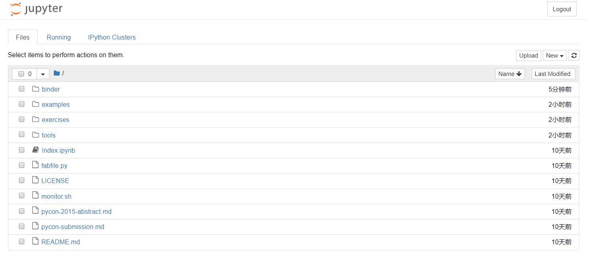
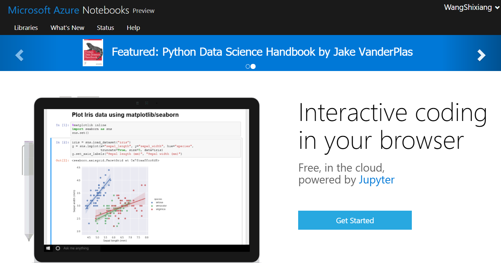
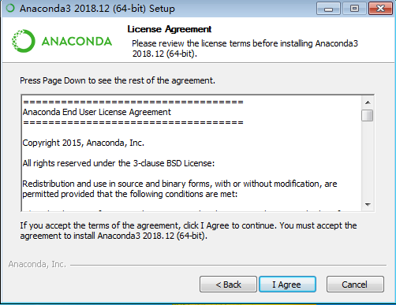
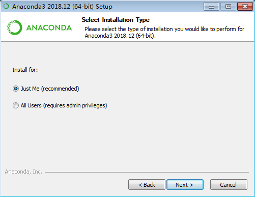
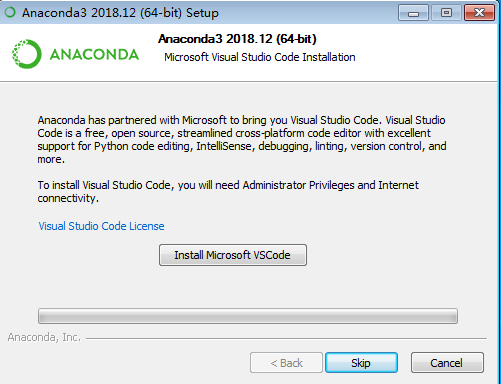

# 第 1 章 Python 介绍及学习前的准备

**本章内容提要**:

- Python 是什么
- 为什么要使用 Python 进行数据分析
- 科学计算核心库简介
- 软件安装与配置

本书在正式向读者介绍 Python 的基本语法与操作之前，通过本章向读者简要介绍 Python 的定义与利用 Python 进行数据处理的优势，详述学习 Python 之前相关软件的安装与配置。

## 1.1 Python 是什么

在 IEEE 发布的 2017 年编程语言排行榜中，Python 高居首位。对于这样一门流行的编程语言，
很多的 Python 入门图书都给它进行定义，但本书作者认为，较为清晰明了的定义来自维基百科：

> Python 是一种广泛使用的高级编程语言，属于通用型编程语言，由吉多·范罗苏姆创造，第一版发布于 1991 年。Python 可以被视之为一种改良(加入一些其他编程语言的优点，如面向对象) 的 LISP。作为一种解释型语言，Python 的设计哲学强调代码的可读性和简洁的语法（尤其是使用空格缩进划分代码块，而非使用大括号或者关键词）。相比于 C++ 或 Java，Python 让开发者能够用更少的代码表达想法。无论是小型还是大型程序，Python 都试图让程序的结构清晰明了。

这段文字囊括了读者需要了解的关于 Python 的基本信息。

1. Python 目前被广泛使用。
2. Python 属于高级编程语言，这区别于 C 语言这样的中级语言或是底层的硬件编程、汇编等语言。
3. Python 由吉多·范罗苏姆创造，于1991年发布。
4. Python 支持面向对象编程（Object-Oriented Programming，OOP）。
5. Python 属于解释型语言，解释型语言以文本的方式存储程序代码，不需要在运行前进行编译（为大众所熟知的 C 语言就不是解释型语言，在运行前必须编译为机器识别的语言）。
6. 强调代码的可读性和简洁的语法是 Python 的设计哲学，这一点尤其需要注意和理解，因为这是 Python 在形式上最有别于其他编程语言之处。Python 使用空格的缩进来划分不同的代码块，其他一些常见语言一般使用大括号或者关键字，正是这个特点，让 Python 代码无论大小长短都看起来非常简单清晰，易于使用（读者将会在本书学习的过程中深入理解这一特点）。

了解一门语言的历史和特点有助于提升读者对其语法的理解和快速应用能力。读者有闲暇不妨通过搜索引擎查查 Python 设计的初衷和一些 Python 开发的著名项目。

## 1.2 为什么要使用 Python 进行数据分析

在成为数据分析和人工智能等领域的头号选手之前，Python 早就因其大量的 Web 框架、丰富的标准库以及众多的扩展库等特点成为网络建站、系统管理、信息安全等领域的热门方案。例如，有名的豆瓣网站就是基于 Python 开发，Linux 所有的发行版都默认安装了 Python。

近年来，Python 的科学计算库（如结构化数据操作库 Pandas、机器学习库 scikit-learn）不断进行改良，使得利用 Python 来进行数据分析成了优选方案。Python 还有一个胶水语言的外号，这来源于它能够非常轻松地集成 C、C++ 等底层代码，进行计算优化。与 SAS 和 R 等分析建模领域特定编程语言相比，Python 可以同时用于项目原型的构建和生产（前者则主要用于项目原型的构建），从而避免了使用多个语言的麻烦。加上Python 本身多年来不断提升的强大编程能力，用户只需要使用 Python 就可以完成以数据为中心的建模、分析与应用。

可以说，Python 在数据分析领域的迅猛发展与其本身非常成熟且广泛应用是分不开的，Python 开源、简明易用的特点也让开发者和使用者自觉倾注精力共同维护社区环境，构建了整个 Python 计算分析领域的良好生态系统。

## 1.3 科学计算核心库简介

Python 拥有着众多的软件包/库，本书难以全部涉及，这里仅介绍几个构成 Python 科学计算生态系统的核心成员。

* NumPy：NumPy 是 Numerical Python 的简称。NumPy 是 Python 科学计算最基础的库，基本上涉及数据分析的软件包都基于它构建。
* Pandas：Pandas 的名字来源于 Python 数据分析（Python data analysis）和面板数据（Panel data）的结合。该库提供了多个数据存储对象，其中的 DataFrame 对象可以表征数据分析常见的二维表格。除此之外，它还提供了非常多便捷处理结构化数据的函数。
* Matplotlib：Matplotlib 起源于矩阵实验室 MATLAB 中的绘图函数，是 Python 中非常流行的绘图库，可以轻松进行二维数据甚至多维数据可视化。
* SciPy：SciPy 库提供了一组专门用于科学计算中各种标准问题包，如数值积分、微分、信号处理、统计分析，它与 NumPy 的结合可以处理诸多科学计算问题。
* Jupyter：Jupyter 是一个交互和探索式计算的高效环境。其中两个组件较为常用，一是 IPython，用于编写、测试和调试 Python 代码；二是 Jupyter Notebook，它是一个多语言交互式的 Web 笔记本，现在支持运行 Python、R 等多种语言，Jupyter Notebook 中代码与 Markdown 的结合可以创建良好、可重复的动态文档。这也是读者进行 Python 数据分析的学习环境。

## 1.4 搭建环境

Python 存在 Python2（现在一般指 Python2.7）和 Python3（现在一般指 Python3.5 及以上）两个不同的大版本。Python 官方宣布于 2020 年停止 Python2 的更新和维护，全面进入 Python3 时代。考虑到学习和应用的普适性，本书的介绍以 Python3 版本为基础。

目前流行的 Python 集成开发环境（IDE）有很多，如 PyCharm、Sublime Text、Eclipse+PyDev 和 Anaconda 中的 Spyder。不同的软件、系统的安装和配置方式各不相同，本书使用 Anaconda 平台的 Jupyter Notebook 对 Python 进行介绍。Anaconda 是非常强大的跨系统开源计算平台，支持个人 PC 使用的 Windows、Linux 和 macOS，提供的近 1000 个开源软件包基本上可以满足个人或团队进行数据处理的需求。

为了满足不同读者的需求，本书介绍两种 Python 线上平台、以及本地机器环境下相关软件的安装和配置，读者可任意选择使用。

### 1.4.1 线上平台

网络上现在有很多在线的 Python 解释器，读者可以在计算机有网络服务的情况下通过浏览器运行代码。因为软件包的导入和计算都在服务器端，所以读者不需要较高配置的计算机就能进行 Python 的学习和数据分析。

本书推荐两个免费的 Jupyter Notebook 网站，读者可结合自己计算机的配置和网络情况进行选择。

1. Jupyter 官方提供的 Try Jupyter 网站 （<https://jupyter.org/try>），该网站包含学习在 Jupyter 中使用 Python 和文本书写的例子和练习，读者可以在 Try Python with Jupyter 的主页（在 Try Jupyter 网站选择使用 Python）运行、调试代码，并下载 Jupyter 笔记本到本地存储。



2. 微软公司提供的 Jupyter 数据探索学习平台 Azure（<https://notebooks.azure.com/>），如图1-2所示，支持在线运行多种编程语言进行数学科学探索，其中比较常用的是 Python 和 R。读者可以通过微软账户创建仓库，新建 Jupyter Notebook 并书写代码和探索数据，完成后可以保存、与他人分享（使用过 GitHub 等开源仓库的读者会发现这个平台的操作和它们极为相似）。



本书作者推荐读者使用 Azure 平台，因为其在创建、使用、保存与分享方面占有优势，不过读者首先需要创建一个微软账号。

随着时间的推移，我们相信会有越来越多的线上 Jupyter Notebook 平台，感兴趣的读者不妨搜索汇总并选择最适合自己学习和使用的平台。

### 1.4.2 本地机器环境下相关软件的安装

读者如果想要在本地部署学习环境，那么可以选择安装两款软件。第一款软件是上文已经提到的 Anaconda，其为必需软件；第二款软件为 nteract（<https://nteract.io/>），见图1-3，为可选软件。与 Anaconda 默认提供的 Jupyter Notebook 不同，nteract 像我们常用的文字编辑器一样，界面非常简洁酷爽，可以非常方便地编辑 Jupyter Notebook 文件（文件扩展名为 .ipynb ）。本书作者推荐读者使用 nteract，本书后续的代码和文档展示都会使用到它，虽然 nteract 目前只有 alpha 版本（测试版），功能还在不断完善中，但是这不会影响读者使用它学习 Python。其实，由于 Jupyter Notebook 与 nteract 运行 Python 都是基于 IPython 内核 ipykernel，除了界面、显示效果和一些细微之处，两者在使用上并没有太多的不同，因此读者不用担心是选择使用默认 Jupyter Notebook 还是 nteract 进行 Python 学习的问题。


#### Anaconda 的下载与安装

读者需要到Anaconda官网下载地址（<https://www.anaconda.com/download/>）下载对应操作系统的 Python3 版本 Anaconda。

在搜索引擎键入关键字 Anaconda 也可以轻松地找到 Anaconda 官网地址，如图1-4所示。


Anaconda 下载页面会根据读者使用的操作系统（Windows、Linux、macOS）自动推荐相应的安装包，如图1-5所示，读者根据自己的操作系统位数（目前市面上的计算机以 64 位为主）点击左侧 Download 下方的下载链接进行下载。


如果读者阅读本书时，Anaconda 的 Python 版本与图1-5所示的 Python3.7 有所不同，读者可以选择更新的版本或者在网络上寻找 Python3.7 版本 Anaconda 进行下载。由于 Python 的向下兼容性，使用更新的版本本书所有示例代码不出意外也都能成功运行。

##### Anaconda 在 Windows 与 macOS 系统上的安装

Windows 与 macOS 系统中 Anaconda 安装都是图形化的，与普通办公软件的安装类似，非常简单。

下面以 Windows 系统下的安装为例进行详细说明。

首先双击下载的 Anaconda 安装器，点击 Next ，如图1-6所示。


程序会弹出许可协议界面，点击 I Agree ，如图1-7所示。



接下来程序要求选择安装类型：读者是为计算机的每一位用户（第二项）还是仅仅当前用户（第一项）安装 Anaconda。如果读者不确定，选择默认选项，点击 Next 即可，如图1-8所示。



接下来读者需要为 Anaconda 选择合适的安装位置。本书作者推荐读者将 Anaconda 安装在用户目录的 Anaconda3 目录（如果不存在可以新建）下，如图1-9。如果读者选择其他目录，请尽量避免安装路径含中文名称。


接下来一步是设定高级安装选项：环境变量。虽然 Anaconda 默认不推荐将 Anaconda 添加到环境变量，但本书作者推荐读者勾选该选项，如图1-10 所示。勾选该选项的好处是读者可以通过终端（Windows 中的 cmd）访问所有的 Anaconda 组件，包括 Python、Spyder、Jupyter Notebook 等。


点击 Install 进行安装。由于安装的东西很多，整个安装过程耗时较长，一般需要半小时左右，请读者耐心等待。


安装进度条完成后点击 Next 。


Anaconda 推荐安装 VS Code 代码编辑器，该软件可装可不装，读者自行选择。如果不安装，点击 Skip 跳过即可，如图1-13所示。



最后点击 Finish 完成安装过程。

##### Anaconda 的 Linux 版本的安装

在 Linux 系统上安装 Anaconda 是使用命令行方式进行的（macOS 也可以），下载完 Anaconda 的 Linux 版本后，打开文件所在目录并在该目录下打开终端（也可以从其他目录使用 cd 命令切换）。

然后，输入命令：

```shell
# 除了使用浏览器，也可以通过终端运行以下命令下载 Anaconda
# wget -c https://repo.anaconda.com/archive/Anaconda3-2018.12-Linux-x86_64.sh

# 添加执行权限
chmod u+x Anaconda3-2018.12-Linux-x86_64.sh
# 执行安装
./Anaconda3-2018.12-Linux-x86_64.sh

# 也可以直接使用Bash进行安装
bash Anaconda3-2018.12-Linux-x86_64.sh
```

接着按照提示按回车键或 Yes 。注意最后安装程序提示是否将 Anaconda 添加到环境变量时一定要键入 Yes 同意。

最后测试下 Anaconda 是否已经安装成功。新建一个终端，键入下面命令将会打开 Jupyter Notebook（在 Windows 操作系统中，使用<Windows+R>组合键，然后输入 cmd ）。

```shell
jupyter notebook
```

默认情况下，浏览器会自动打开，跳转到主页面，如图1-14。


如果读者还想要进一步了解 Anaconda 及其安装、Jupyter Notebook 相关知识，不妨多查阅网络上的资料，目前网上相关的介绍和问题解答非常丰富。


#### nteract 下载与安装

读者可以到 nteract 官网（<https://nteract.io/>）下载不同操作系统对应的软件版本，Windows、macOS 与 Linux上 都可以直接点击安装。

安装后直接点击软件图标打开，软件主界面如图1-15所示。


单击菜单栏中的 Runtime ，如果出现 Python 字样，那么说明 nteract 可以正常使用，同时左下方也会出现 python3 标记。如果没有出现上述内容，那么读者需要检查是否已经成功安装 Anaconda 并将其添加到环境变量。

到此为止，读者已经成功地搭建 Python 的学习环境，迈出了学习 Python 数据分析的第一步。从下一章开始，我们将正式进入 Python 基本语法与操作的学习。

## 1.5 章末小结

本章向读者简要介绍了 Python 的定义、使用 Python 进行数据分析的优势、进行科学计算的几个重要库（软件包）以及线上 Python 平台、本地 Python 学习环境的安装。本书推荐读者使用 Anaconda（必备）与 nteract（可选）作为读者的 Python 学习平台。

Anaconda 已经在数据分析领域中广为流行，其中 Jupyter 是核心工具。Jupyter Notebook 和 nteract 都是基于 Jupyter 底层核心的图形界面，读者可以根据自己的实际情况灵活选择和使用。除此之外，Python 流行的集成开发环境（Integrated development environment，IDE）或代码编辑器很多，各有特色，倾向使用其他 IDE 或编辑器的读者不妨参考网络资料进行 Python 环境的配置。

Anaconda 平台除了 Jupyter，还包含一些其他的重要软件和插件（如Spyder、Jupyter Lab）。因为对它们的介绍不是本书核心内容，所以没有在本章一一罗列，感兴趣的读者可以通过网络资料进行了解和学习。

