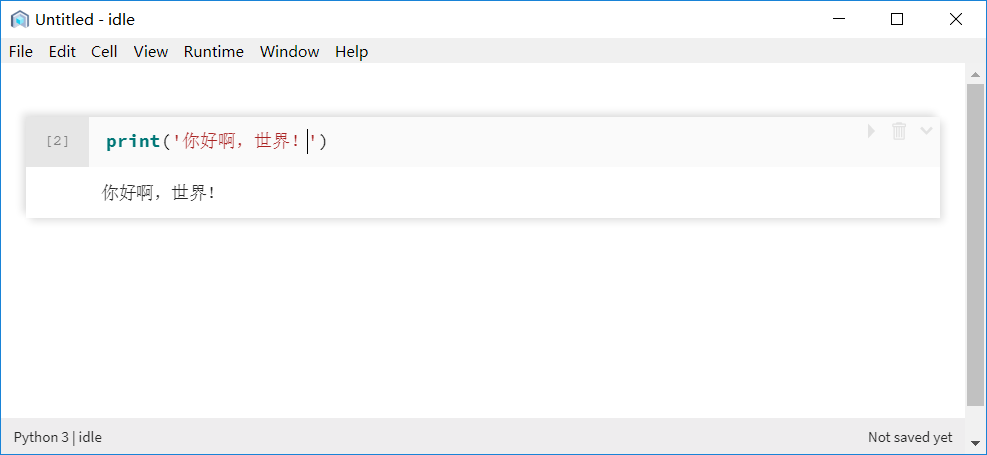
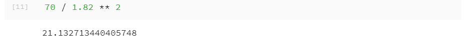

# 第2章 Python入门示例及基础知识 {#base}

**本章内容提要**:

- Python 解释器
-	编写第一行 Python 代码
- Notebook 初使用
-	利用 Python 进行数学运算
-	变量的命名和使用
-	Python 基本数据类型

本章首先介绍 Python 的解释器，然后展示 Python 的一个入门示例，并简单介绍 nteract 软件的使用，
接着介绍 Python 的基础知识，包括 Python 的基本操作符、变量的命名与使用、Python 的基本数据类型等。
对于基础知识的介绍，本书将通过实例展示、解析其含义并进行延伸。
复杂的代码总是可以拆解为一小块一小块基本操作的集合，Python 易读易懂的语言特性让这一概念更为形象。

## 2.1 Python 解释器与 IPython

相比于 C、C++、Java 等编程语言，Python 代码的运行并不需要提前进行编译，
而是通过 Python 解释器进行解释和执行，所见即所得。
专业术语称拥有这种特性的编程语言为解释性或动态语言。

### 2.1.1 标准 Python 解释器

读者可以在命令行中输入「python」命令打开标准的交互 Python 解释器。
如果读者使用 Windows 操作系统，点击开始－>运行－>键入「cmd」即可进行命令环境。
如果读者使用 macOS 或 Linux 系统，请直接打开终端。
输入「python」后读者会看到类似下面的输出（此处以 macOS 系统为例）：

```
Python 3.7.0 (default, Jun 28 2018, 07:39:16) 
[Clang 4.0.1 (tags/RELEASE_401/final)] :: Anaconda, Inc. on darwin
Type "help", "copyright", "credits" or "license" for more information.
>>> 
```

上面输出中前几行显示了 Python 的版本信息、使用的是 C 语言编译器 Clang（Python 语言本身的底层实现标准是C语言）以及
该 Python 由 Anaconda 公司发布。

「>>>」是命令提示符，读者可以在后面输入命令并按下回车键，Python 解释器会对命令进行解释并返回结果。
读者如果要退出 Python 解释器返回终端，那么输入 exit() 或按 <Ctrl+D>。
整个过程就像一场人机对话，用户在命令提示符后输入指令，Python 会忠实地执行并返回结果以供程序员阅读。
不过，这一切都基于读者熟练掌握 Python 基础语法。

### 2.1.2 IPython

大部分 Python 程序员都是通过上述方式执行 Python 命令的，但从事数据分析和科学计算的专业人士
更喜欢使用 IPython 或 Jupyter Notebook。IPython 是一个强化的 Python 解释器。
Jupyter Notebook则是一个网页代码笔记本，它原是 IPython 的一个子项目。
读者可以简单将 Jupyter Notebook 看做一个基于浏览器的 IPython 图形界面，使用起来更加直观和优化，并且支持文本和图像的嵌入。nteract 软件则可以看做 Jupyter Notebook 的本地版本，使用跟 Jupyter Notebook 基本一致。
Jupyter Notebook 和 nteract 创建和保存的文件都是 Jupyter 笔记本，文件扩展名为「.ipynb」，
因此两个软件编辑的内容是可以通用的。考虑到本地浏览器使用 Jupyter Notebook 可能会出现不稳定的情况，
本书选择 nteract 软件进行一些结果的展示，并推荐读者使用。

读者如果更喜欢文本式样的终端界面进行 Python 命令的操作，
可以在命令行中输入 ipython 进入 IPython 解释器（也称为 IPython Shell），如下所示：

```
Python 3.7.0 (default, Jun 28 2018, 07:39:16) 
Type 'copyright', 'credits' or 'license' for more information
IPython 6.5.0 -- An enhanced Interactive Python. Type '?' for help.

In [1]: 
```

初学者会立刻发现 Python 标准解释器与 IPython 解释器形式上的一个重要区别是 IPython 使用代码执行的次序作为命令提示符。
「In [1]:」表示等待用户输入第一条语句，输出结果一般会以类似「Out [1]」的方式标记，也可能没有（后面的学习中读者会看到）。
IPython 有非常多比 Python 标准解释器更强大的功能与特性，像自动补全，输出优化，魔术命令等，这些都等待读者发掘和体验。

在后续的章节中，本书对 Python 的介绍都是基于 IPython 解释器。Python 命令的操作无论是
通过 IPython Shell 还是图形界面（即 Jupyter Notebook、nteract）都可以实现，读者可以选择自己喜欢的操作方式。

## 2.2 Python 入门示例

在很多的编程学习书籍或者教学中，第一个代码实现通常是向屏幕输出「Hello World!」，让程序向世界问好。
本书是一本中文书籍，下面就向读者介绍如何用 Python 实现输出它的中文版本「你好啊，世界！」。

首先，打开软件 nteract。在 nteract 输入框中输入「print('你好啊，世界!')」，
然后按下快捷键 <Ctrl+Enter>（在 macOS 系统中，将<Ctrl>键换为 \<command> 键即可），输出结果如图2-1所示。



除了使用快捷键，读者还可以单击输入框右上角的三角形图标按钮运行程序。

读者如果使用 Jupyter Notebook，在命令行中输入「jupyter notebook」即可打开软件。
在多数平台上，Jupyter 会自动打开默认的浏览器（除非指定了「--no-browser」）。
或者，可以在启动 Jupyter Notebook 之后，手动打开网页「<http://localhost:8888/>」。
在命令行中输入快捷键 <Ctrl+C> 可以退出 Jupyter Notebook。
如果要新建一个 Python 笔记本，点击按钮「New」，选择「Python3」，读者会看到与图2-1类似的界面和输入框。
Jupyter Notebook 的运行的快捷键与 nteract 一致，运行标志位于浏览器上方的工具栏中。

这行代码仅包含 16 个字符，其中 7 个字符是读者都认识的中文「你好啊，世界！」，毫无疑问是输出的文字。
其他 9 个字符是有些读者暂时还不理解的「print」、「()」和「''」，它们分别有什么含义呢？

print 是 Python 提供的一个函数，它的功能是向屏幕输出用户定义的字符（串）。
Python 函数依赖英文括号「()」来区分用户输入的内容中什么是它要处理的对象，
而这个对象就是由单引号「''」括起来的文字。

为了证明上述说明的正确性，下面向输入框中输入以下内容进行测试：

```
print('你好啊，世界！)

print('你好啊，世界')!
```

结果如图2-2所示。


显然，这两句代码存在问题，命令没有成功运行，程序抛出了「SyntaxError」，即语法错误。

由此可见，遵守 Python 的语法规则非常重要，本书后续内容会对其逐步进行介绍。

## 2.3 nteract 软件使用简介

通过图2-1和图2-2，读者应该可以发现，每一行代码和对应的输出结果在 nteract 软件界面中都单独存在于一个块中，
每一块都是一个相对独立的代码单元，这个代码单元可以称为单元格（Cell），如图2-3所示。


单元格中呈现的所有信息实际上都会被存储为 Jupyter 笔记本，它以特定的「.ipynb」作为文件扩展名，如图2-4所示。
nteract 软件保存的 Jupyter 笔记本与基于浏览器的 Jupyter Notebook 创建/保存的笔记本是完全一致的，
只是以两种不同的形式展现出来（就像同一张图片读者可以用不同的软件打开、查看和编辑）。
因此，读者完全可以将用 nteract 软件创建的笔记本上传到网络上（比如开源仓库 GitHub）并
用 Jupyter 的 nbviewer（<http://nbviewer.jupyter.org/>）查看，
或者上传保存到微软的数据分析平台（<https://notebooks.azure.com/>）进行查阅、编辑和分享。
同样地，读者也可以将网络上优秀的 Jupyter 笔记本下载到本地，使用 nteract 打开，并进行学习和分析。

nteract 软件除了现在界面语言只有英文这个缺陷以外，其他功能都设计得非常好。
读者可以像平常使用 Windows 系统中的软件一样，用鼠标对单元格进行操作，
常见的运行、删除都以图标的方式显示在单元格的右上角，使用起来很方便。
习惯于使用快捷键的用户，还可以通过菜单栏中的各个选项了解快捷键的使用。


在运行代码时，常见的两个快捷键是 <Ctrl+Enter> 及 <Shift+Enter> 键。
前者运行当前单元格，后者先运行单元格，然后新建一个单元格。相对而言，后者更为便利，使用也相对频繁些。
  
nteract 中每个单元格左侧都有「[]」标记，在代码运行后，中间会出现数字，
该数字标记了单元格运行的次序（从 1 开始）。如果不同单元格的代码运行次序会对结果产生影响，
读者需要关注下运行次序，否则在一般的情况下，读者可以忽略它的存在。


## 2.4 算术运算

算术运算是数据分析的基础。本节介绍 Python 中的算术运算符，并给出计算身体质量指数的示例。

### 2.4.1 简单数学运算

在完成第一个 Python 代码后，读者是不是迫切想了解 Python 是如何实现数据的计算的呢？
下面从简单的四则运算开始介绍 Python 中的算术运算操作符，如图2-5所示。


图中代码语句只有数字1和算术运算操作符，可见「+」、「-」、「*」、「/」分别对应日常的四则运算符号。
「1 / 1」的结果怎么是「1.0」？不应该是「1」吗？

这是因为在 Python的 除法运算中，运算符「/」进行的是浮点除法操作，而运算符「//」进行的是整除操作，结果如图2-6。
另外，Python 还提供了求余操作符「%」。


Python 中比较完整的算术运算操作汇总如下：

```python
3 + 2             # 加法
3 / 2             # 浮点数除法
3 // 2            # 整除
3 * 2             # 乘法
3 ** 2            # 指数（幂）
3 % 2             # 求余
abs(a)            # 绝对值
```

### 2.4.2 代码约定

通过上面的示例本书向读者简单介绍了如何利用 nteract 创建和使用 Jupyter Notebook 并用它输入 Python 代码。
为了提升本书作者代码书写的效率，本书接下来的章节内容尽量使用文本的形式展示代码和结果，
读者可以根据前文的介绍操作 nteract 或 Jupyter Notebook 图形界面进行学习，也可以使用 IPython Shell 操作文本界面学习。

例如，关于图2-5中的几个运算操作，本书使用下列代码行代替。

```python
In [3]: 1 + 1
Out[3]: 2

In [4]: 1 - 1
Out[4]: 0

In [5]: 1 * 1
Out[5]: 1

In [6]: 1 / 1
Out[6]: 1.0
```

代码左侧的「3」、「4」标定了作者在 IPython Shell 中运行代码的次序，这并不是指必须在「[3]」运行后才能运行「[4]」。

### 2.4.3 计算身体质量指数

上文介绍了如何使用 Python 进行简单的计算，那么现在把所学的知识用来做一件更有实际意义的事情——计算自己的身体质量指数。

身体质量指数（BMI）是目前国际上常用的衡量人体胖瘦程度以及是否健康的一个标准，
相信不少读者在进行体检时都会测量这个指标，它是用体重公斤数除以身高米数的平方得出的数字。
也就是说，只要知道自己的身高和体重，就可以自己计算 BMI。

例如作者本人，身高 1.82m，体重 70kg 左右，计算后的 BMI 指数为：

```python
In [11]: 70 / 1.82 ** 2
Out[11]: 21.132713440405748
```

nteract 结果显示如图2-7。



有时，当用户将自己编写的代码发给其他人时，其他人可能完全不懂代码是什么意思，此时该怎么办呢？

解决的办法是给代码加上中文/英文注释，这样其他人就能够通过注释来理解这些数学符号所代表的含义。
在 Python 中，使用井号键「#」可以引导一行注释，因此上述代码添加注释后的效果为：

```python
In [12]: 70 / 1.82 ** 2  # 计算我的BMI
Out[12]: 21.132713440405748
```

注释也可以出现在对应代码的前一行，但不能出现在对应代码的前面，不然代码自身也会被当作注释而无法运行。

```python
In [13]: # 计算我的BMI
In [14]: 70 / 1.82 ** 2
Out[14]: 21.132713440405748

In [15]: # 计算我的BMI  70 / 1.82 ** 2
```

标记为「13」和「15」的两行没有对应的输出标记，它们并没有被 Python 执行，因而没有相应的输出结果。
实际上，Python 会在运行前检查输入的语句块，若发现它是以「#」开头的语句，那么跳过去（不执行）；
若代码存在语法错误，那么 Python 会停止运行并给出相应的错误和提示，例如：
  
```python
In [16]: 计算我的BMI指数 70 / 1.82 ** 2
  File "<ipython-input-16-b7d966d13e1f>", line 1
    计算我的BMI指数 70 / 1.82 ** 2
               ^
SyntaxError: invalid syntax
```

为代码添加注释是一个编写程序时的良好习惯。注释可以使得代码便于追溯并且可以提高程序可读性。
良好的代码注释能够帮助自己或他人快速理解和重用程序或代码块，提升编程的效率和能力。

## 2.5 变量简介

### 2.5.1 什么是变量

仅仅使用字面意义上的 70、1.82 这些数字很快就会引发烦恼，比如当读者与朋友的 BMI 进行比较时，
会很快对输入数字感到烦琐，甚至对编写程序失去兴趣。另外，一旦操作涉及较多的运算符，
它所展现的意思已经不那么明显了。

```python
In [9]: # 与朋友比较BMI指数
In [10]: 70 / 1.82 ** 2
Out[10]: 21.132713440405748

In [11]:  48 / 1.64 ** 2
Out[11]: 17.846519928613922

In [12]: 70 / 1.82 ** 2 - 48 / 1.64 ** 2
Out[12]: 3.2861935117918257
```

我们需要一种既可以储存信息，又可以对它们进行操作的方法。这正是变量存在的意义。变量是一种这样的东西——它们的值可以变化，因而读者可以使用变量存储任何信息，如身高、体重、日期、天气情况、手机号码等等。变量本身只是计算机中存储信息的一部分内存，为了访问它存储的信息，我们需要给变量命名。而将信息（数据）存为变量的操作，称为赋值。

例如，将身高和体重存储为变量：

```python
In [13]: height = 1.82

In [14]: weight = 70
```

其中「=」是赋值操作符，注意，它不是表示相等！「height = 1.82」的语义为：将数字 1.82 赋值给变量 height。

可以通过 print() 函数或者直接输入变量名来输出变量保存的信息：

```python
In [15]: print(height)
Out[15]: 1.82

In [16]: print(weight)
Out[16]: 70

In [17]: height
Out[17]: 1.82

In [18]: weight
Out[18]: 70
```

因而与朋友比较 BMI 指数可以写为：

```python
In [19]: myBMI = 70 / 1.82 ** 2  # 我的BMI

In [20]: friendBMI = 48 / 1.64 ** 2  # 朋友的BMI

In [21]: myBMI - friendBMI  # 我与朋友的BMI值得差异
Out[21]: 3.2861935117918257
```

### 2.5.2 变量的命名

变量的命名需要遵循下列的规则：

* 第一个字符必须是字母表中的字母（大写或小写）或者一个下划线「_」。
* 其他部分可以由字母（大写或小写）、下划线「_」或数字（0~9）组成。
* 变量名称是大小写敏感的。例如，myname 和 myName 不是同一个变量。注意前者中的小写 n 和后者中的大写 N。

i、__my_name、name_23 和 a1b2_c3是有效的变量名称。2things、this is spaced out 和 my-name 是无效的变量名称。

下面举个代码：

```python
IIn [22]: __myName = "ShixiangWang"

In [23]: my-name = "ShixiangWang"
  File "<ipython-input-23-1b106abe1308>", line 1
    my-name = "ShixiangWang"
                            ^
SyntaxError: can't assign to operator

```

给变量命名是编程的基础。新手往往在处理简单问题时往往会选择 a、b、c 这样的名字，若有多组变量，可能还会使用 a1、a2、a3 这样的方式命名。这样简单的命名方式是不推荐的，变量的名字应该具有非常清晰的含义。对于我们现实中的事物，如小狗，我们给小狗取一个好名字固然重要，但它并不会改变小狗本身。但变量不是这样的，变量和变量名本质上是同一个事物，因此，变量的好与坏就在很大程度上取决于它的命名的好与坏。

想要获得好的变量名，注意如下事项：

* 首先需要考虑的事项是，该变量名要完全、准确地描述出该变量所代表的事物。
* 一个好的变量名通常表达的是「什么」（what），而不是「如何」（how）。通常而言，如果一个变量名反映了计算的某些方面而不是问题本身，那么它反映的就是「如何」，而非「什么」。例如，同样一个命名，calcVal 比 sum 更偏向于「如何」，因此不提倡。
* 适合的变量名长度：10~16 字符之间。但更重要的是长度和清晰度之间的平衡，通常较短的名称适用于局部变量或者循环变量，较长的名称适用于很少用到的变量或者全局变量（全局变量与局部变量会在后面的章节介绍）。
* 变量中的计算值限定词：表示计算结果的词，如总额、平均值、最大值、等等，如果读者要用类似于 Total、Sum、Average、Max、Min、Record 这样的限定词来修饰某个名称，那么可以把限定词加到名字的最后，如 revenueTotal、expenseAverage 等。这样做的目的是将为这一变量赋予主要含义的部分放到最前面，提高可读性。

上述是对《代码大全》中「如何定义一个好的变量名」部分的归纳，读者在开始时并不一定能完全理解和熟练使用它，但需要记住一个思想：给变量命名是一件非常重要的事情。在行动上，每次对变量命名后应当有意识地思考一下该名字是否能准确地描述出变量所代表的事物，如果不能，需要重新取一个新的名字。关于变量的命名，本书推荐一个协助工具——CODELF（<http://unbug.github.io/codelf/>）。


## 2.6 基本数据类型

「算法+数据结构=程序」，这是 1984 年图灵奖的获得者 Niklaus E. Wirth 阐述的一个经典观点。较为数据的结构常常由多个数据类型组成，其中数字、字符串与布尔值是 Python 基本的内置数据类型，它们是数据表达、存储的基础。而 Python 中其他常见的数据类型，如下一章会学习和使用的列表，是基于这 3 种数据类型的组合构建的新类型。

### 2.6.1 数字

在 Python 中，数字包括 4 种类型：整数、长整数、浮点数和复数。

* 此处所指的整数和数学中的整数是对应的，如 1、2、3、4 等。
* 长整数是指大一些的整数。
* 3.23 和 5E-4 是浮点数的例子。E 标记表示 10 的幂，是一种科学计数法。在这里，5E-4 表示 5 乘以 10 的 -4 次方，即 0.0005。
* (-5+4j) 和 (2.3-4.6j) 是复数的例子。

### 2.6.2 字符串

字符串是字符的序列，基本上就是一串字母、数字或符号的组合。

下面列出字符串的使用方法。

* 可以使用英文单引号「''」指示字符串，如「'Quote me on this'」。所有的空白，包括空格和制表符都照原样保留。
* 也可以使用双引号「""」来指定字符串，它的方式与英文单引号中的字符串的使用完全相同，如「"What's your name?"」。
* 利用三引号「'''」或「"""」可以指示一个多行的字符串。读者可以在三引号中自由地使用英文单引号和英文双引号。例如：
    ```python
    '''This is a multi-line string. This is the first line.
    This is the second line.
    "What's your name?," I asked.
    He said "Bond, James Bond."
    '''
    ```

#### 转义符

假设读者想要在一个字符串中包含一个英文单引号，那么该怎么指示这个字符串？例如，这个字符串是「What's your name?」。
「'What's your name?'」肯定是错误的使用方式，因为 Python 会弄不明白这个字符串从何处开始，何处结束。
此时，读者需要告诉 Python 第 2 个单引号不是字符串的结束，这可以通过转义符来实现完成。
转义是通过反斜杠「\\」实现的，也就是表示为「'What\\'s your name?'」，这样转义符后的英文单引号就只起到单引号的作用了。

另一个方法是单双引号嵌套，如「"What's your name?"」，此处将英文单引号嵌入英文双引号中，
Python 会发现英文双引号是字符串的起止符号，因而此处的英文单引号会被正确的解析。
类似地，要在英文双引号字符串中使用英文双引号本身的时候，也可以借助于转义符或使用嵌套。
如果要显示反斜杠本身，那么使用两个转义符号。

```python
In [26]: 'What's your name?'  # 错误的表示方法
  File "<ipython-input-26-dff8324f3597>", line 1
    'What's your name?'  # 错误的表示方法
          ^
SyntaxError: invalid syntax


In [27]: 'What\'s your name?'  # 使用转义\对字符串中的英文单引号进行转义
Out[27]: "What's your name?"

In [28]: "What\'s your name?"  # 将英文单引号嵌入英文双引号中
Out[28]: "What's your name?"
```

值得注意的是，在一个字符串行末，单独一个反斜杠表示字符串在下一行继续，而不是开始一个新的行。例如：

```python
    "This is the first sentence.\
    This is the second sentence."
```

等价于「This is the first sentence. This is the second sentence.」。

#### 自然字符串

如果想要表示某些不需要如转义符那样特别处理的字符串，那么可以指定一个自然字符串。自然字符串通过给字符串加上前缀 r 或 R 来指定。

例如，r"Newlines are indicated by \n"，其中「\n」是文本的换行符，请读者自己输入下面语句并理解结果的不同：

```python
In [35]: "Newlines are indicated by \n"
Out[35]: 'Newlines are indicated by \n'

In [36]: r"Newlines are indicated by \n"
Out[36]: 'Newlines are indicated by \\n'

In [37]: print(r"Newlines are indicated by \n")
Out[37]: Newlines are indicated by \n

In [38]: print("Newlines are indicated by \n")
Out[38]: Newlines are indicated by
# 此处输出一个空行
```

#### Unicode字符串

Unicode 是书写国际文本的标准方法（也称为万国码）。在 Python中，只需要在字符串前加上前缀 u 或 U 就可以处理 Unicode 字符串，
如 u"This is a Unicode string."。当读者知道文本中含有非英语写的文本时，最好使用 Unicode 字符串。


### 2.6.3 布尔值

任何一门编程语言都会存在布尔类型，用来表示「真」和「假」。这不仅仅是因为计算机的基础是二进制，
而且我们人类对于事物的基本判断也是二元的，往往不是「真」就是「假」。

在 Python中，True 代表「真」，False 代表「假」。注意，Python 是大小写敏感的语言，false 不等同于 False。


### 2.6.4 查看数据类型

上文已经介绍了 Python 的 3 个基本数据类型，那么在实际的使用过程中，读者该如何知道某个变量是哪一种类型呢？

例如，有下列进行赋值的4个变量：

```python
In [45]: type1 = 1

In [46]: type2 = 1.0

In [47]: type3 = "1"

In [48]: type4 = True
```

读者可以使用 type() 函数查看变量的数据类型，如下所示：

```python
In [49]: type(type1)
Out[49]: int

In [50]: type(type2)
Out[50]: float

In [51]: type(type3)
Out[51]: str

In [52]: type(type4)
Out[52]: bool
```

结果中的 int、str 与 bool 分别是 integer（整数）、string（字符串）与 boolean（布尔值）的缩写。


## 2.7 数据运算

上一节介绍了 Python 的基本数据类型，但除了数学运算，本书还没有实际演示其他数据类型是如何操作的，以及这些基本的数据类型如何相互转换和配合使用。

### 2.7.1 加号与黑箱子

读者已经知道数字 1+1 的结果是它们的和，那么字符「'1'+'1'」的结果又是什么呢？

```python
In [2]: '1' + '1'
Out[2]: '11'
```

上述代码中 + 号可以将两个字符进行连接！如果读者想尝试下减号，那么可能会有点失望——它并不能从一个字符串中去除另一个字符：

```python
In [3]: '1' - '1'
---------------------------------------------------------------------------
TypeError                                 Traceback (most recent call last)
<ipython-input-3-3f89fba82f3e> in <module>()
----> 1 '1' - '1'

TypeError: unsupported operand type(s) for -: 'str' and 'str'
```

可是，为什么 + 既可以求数字的和，又能连接字符呢？

为了帮助读者理解，这里必须提到一个称为泛型的概念，直观的理解，就是一个黑箱子。
例如，1+1 和 '1'+'1' 使用的 + 号虽然从外表看都是相同的符号，但实际上它是一个函数，
会根据不同的输入数据类型（如数字、字符）执行函数内部不同的代码语句。

### 2.7.2 类型转换

读者已经知道通过 type() 函数可以判断 '1' 是字符 1 还是数字 1，但该怎么将字符 1 变成数字 1 呢？
就是将 str 类型转换为 int 类型。Python 有相应的函数可以完成类型转换操作。

例如，下面第二条语句中使用 int() 函数将字符 1 转换为了整数 1。

```python
In [8]: type('1')
Out[8]: str

In [9]: type(int('1'))
Out[9]: int
```

注意，字符串与数字不能够进行连接 + 操作，必须将一方的类型转换为另一方的类型，不然会抛出语法错误。

```python
In [10]: "我的语文和数学成绩之和是 " + 199
---------------------------------------------------------------------------
TypeError                                 Traceback (most recent call last)
<ipython-input-10-17fa10d93550> in <module>()
----> 1 "我的语文和数学成绩之和是 " + 199

TypeError: must be str, not int

In [11]: "我的语文和数学成绩之和是 " + str(199)
Out[11]: '我的语文和数学成绩之和是 199'
```

这里使用 str() 将数字199强制转换为字符。相似的函数有 int()、float() 以及 bool()。

### 2.7.3 运算符汇总

Python 常用的内置操作符包括算术运算操作符、字符串操作符、比较操作符与布尔逻辑操作符，它们汇总如下，并给出了一些简单的实例，读者可自行运行示例并仔细体会。

1）算术操作符：

```python
9 + 2 # 加
9 - 2 # 减
9 * 2 # 乘
9 / 2 # 除（浮点输出）
9 //2 # 整除
9 % 2 # 求余
9 **2 # 幂
```
 
2）字符串操作符：

```python
'这是一个' + '字符串' # 字符串连接
'这是一个字符串' * 5  # 字符串重复
```

3）比较操作符：

```python
5 == 4  # 等于
5 > 4   # 大于
5 < 4   # 小于
5 != 4  # 不等于
5 >= 4  # 大于或等于
5 <= 4  # 小于或等于
```

4）布尔逻辑操作符：

```python
True and True   # 逻辑“与”
True or False   # 逻辑“或”
not False       # 逻辑“非”
```


## 2.8 章末小结

作为介绍 Python 语法知识的第一个章节，本章详细介绍了 Python 两种解释器、最为基础的语法、算术操作、逻辑操作以及 Python 基本的数据类型——数字、字符串与布尔值。

除此之外，本章简单介绍了 Notebook 的基本概念和操作。
无论读者是直接使用 Jupyter Notebook（本地/远程浏览器）还是使用 nteract（本地软件），
Notebook 操作大同小异，读者需要多加练习进行掌握。
本章内容虽精未必全，一些偏僻的知识点未能一一介绍，读者在学习本书之余可参考网络知识辅助学习。


