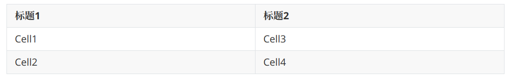
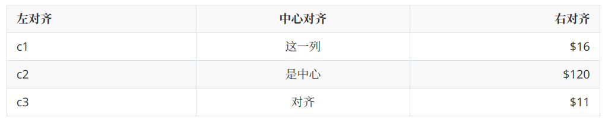
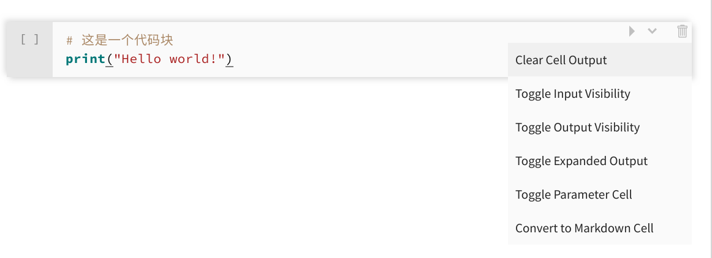
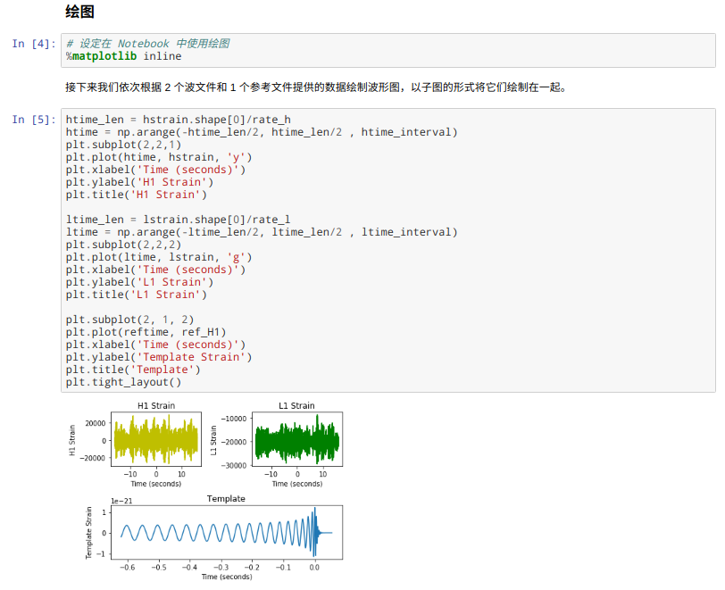

# 第 9 章 Markdown 基础

**本章内容提要**：

- 为什么学习 Markdown
- Markdown 支持软件
- Markdown 基础语法
- Markdown 文档范例

网络促进了知识的传播与分享。各大技术博客、自建博客中，伴随着当前编程技术知识流行于网络的，还有书写知识的工具，它就是 Markdown。也许会有读者对一本 Python 书籍使用一章的篇幅讲解 Markdown 的知识感到奇怪，但毋庸置疑的是，潮流已经将它与 Python 联系在一起，让我们勇敢地拥抱它吧。

## 9.1 Markdown 简介

Markdown 由 John Gruber 于 2004 年创建，它是一种轻量级标记语言。轻量级标记语言是指一类用简单语法表述文字格式的文本语言，即直接能从字面上进行阅读和理解。Markdown 的目的是提供一种容易阅读、容易书写的纯文字格式，它吸收了电子邮件中许多已有的标	记特性，并可以有效地转换为富文本语言，如 HTML。

由于 Markdown 轻量、易读、易写的特性，并且支持图片、表格、数学公式，目前许多网站都采用 Markdown 来编写帮助文档或发布消息，比较有名的有 GitHub、reddit 和 Stack Overflow。另外，Markdown 也常用与博文、书籍的撰写。甚至当前网络应用、App 专门提供 Markdown 服务，如简书、Slack。

随着时间的推移，出现了许多 Markdown 的实现。这些实现的目的是在 Markdown 基础语法之上添加一些额外的功能，如列表、脚注等。另外，在数据分析领域，一种新型的文档出现了，它可以将文本嵌入运行的代码中，称为动态文档，而文本书写的语法正是 Markdown。目前流行的动态文档主要有 2 种，一种是 Jupyter Notebook，它支持多种编程语言，包括 R、Python；另一种是 Rmarkdown，它在 Markdown 的基础上增加了 R 语言代码块的执行功能（也有对 Python、Shell 的支持，但功能较弱）。

动态文档的出现使得数据分析不再像是在写单纯的功能脚本，而是图文并茂的文章，而且增强了交互性和可重复性，已经是当下数据分析人员必备的一个技能之一。

在本章接下来的内容中，本书将对 Markdown 的基础语法进行简要介绍并结合 Python 分析实际使用进行举例。

## 9.2 Markdown 语法

为了更好地向读者展示 Markdown 语法的显示效果，这一节本书使用了一个开源且非常流行的工具 Typora。读者可以下载该软件并自己根据学习和理解测试效果，当然也可以使用 Jupyter Notebook 或 nteract，不过相对而言 Typora 更为美观。

### 9.2.1 块元素

#### 段落

Markdown 中，段落是通过一个及以上空行来分割的。如下所示：

```
这是第一段话

这是第二段话
```

如果只是使用回车键，内容还是属于一段，文字是连接起来的。

例如，「这是第一句话。这是第二句话。」可以写为如下形式：

```
这是第一句话。
这是第二句话。
```

#### 标题

Markdown 支持 6 级标题，一般前四级比较常用。指定标题的方式是在文字前面添加井号键，有几个就是几级标题。

```
# 这是一级标题

## 这是二级标题

### 这是三级标题

#### 这是四级标题

##### 这是五级标题

###### 这是六级标题
```

注意井号后面加一个空格。


#### 引用

Markdown使用符号 > 起始一段块引用。引用也可以有多段文字，换行以单独的 > 为一行。

```
> 这里有3段引用，前面2段引用是在一起的，最后一段引用是独立的。
>
> 这是第2段引用。


> 这是第3段引用。
```

下面则是 Markdown 显示的效果。

> 这里有3段引用，前面2段引用是在一起的，最后一段引用是独立的。
>
> 这是第2段引用。


> 这是第3段引用。

#### 列表

输入「\* 元素1」就可以创建一个无序列表，除了使用星号 \*，还可以使用 +、-。一般常用 \* 或者 -。而输入「1. 元素1」可以创建有序列表。

Markdown 源代码如下：

```
## 无序列表

* 石头
* 剪刀
* 布

## 有序列表

1. 石头
2. 剪刀
3. 布
```


#### 任务列表

在列表符号后面使用 [ ] 或 [x] 可以分别标记未完成或完成状态。例如：

```
## 作业完成情况

- [ ] 语文
- [x] 数学
- [ ] 物理
- [ ] 英语
- [x] 化学
```

注意，标记未完成时括号内一定要有一个空格。


#### 代码块

代码块以 3 个符号 \` 起始（键盘上 \<ESC> 键下方的撇号），同样以 3 个 \` 结束。除了对代码格式比较友好，很多支持 Markdown 的工具、网站对代码块都自动高亮的功能。

~~~gfm
下面是一个例子：

```
def test():
    print("Hello World!")
```


语法高亮：

```python
def test():
    print("语法高亮")
```
~~~


#### 数学块

有不少 Markdown 编辑器通过 MathJax 支持 LaTex 数学表达式。

数学公式使用两个美元符 \$\$ 开始和结束。

```
$$
\mathbf{V}_1 \times \mathbf{V}_2 =  \begin{vmatrix}
\mathbf{i} & \mathbf{j} & \mathbf{k} \\
\frac{\partial X}{\partial u} &  \frac{\partial Y}{\partial u} & 0 \\
\frac{\partial X}{\partial v} &  \frac{\partial Y}{\partial v} & 0 \\
\end{vmatrix}
$$
```

效果如下：


这里只是展示 Markdown 支持这种数学公式，LaTex 语法本身读者需要参考其他资料学习使用。

#### 表格

使用「|列1|列2|」就可以添加 2 列表格，标题行和内容行使用「|---|」进行分隔。

```
| 标题1   | 标题2 |
| -------| ----- |
| Cell1  | Cell3 |
| Cell2  | Cell4 |
```



对齐可以通过对分隔行增加英文冒号 : 标记实现。

```
| 左对齐  | 中心对齐 | 右对齐 |
| :----- |:-------:| -----:|
| c1     | 这一列   | $16 |
| c2     | 是中心   | $120 |
| c3     | 对齐     | $11 |
```



#### 脚注

```
你可以像这样添加脚注[^footnote]。

[^footnote]: 这是一段脚注文字
```

效果如下：


#### 水平线

在空行中使用 \*\*\* 或者 --- 就可以生成一条水平分隔线。

### 9.2.2 内联元素

#### 链接

Markdown 支持行内和参考两种链接方式，链接的文字都是写在方括号内。

行内链接的写法如下：

```
[这个链接](https://baidu.com)会跳转到百度
```


参考链接的写法如下：

```
[这个链接][id]会跳转到百度

[id]: https://baidu.com
```


#### URL

URL 使用 2 个尖括号将文本包围，与链接不同的是 URL 的显示的就是尖括号内的文字，不能自定义显示内容。


```
<https://baidu.com>

<xxx@163.com>
```


#### 图片

图片跟链接相似，但是需要在链接的前面添加一个英文感叹号 ! 符号。

```


例如：

```


路径可以是 URL，可以是计算机本地的绝对路径或相对路径。

#### 强调与加粗

Markdown 使用星号或下划线强调文字。

```
*使用星号*

_使用下划线_
```

*使用星号*

_使用下划线_


使用两个符号则是进行加粗。

```
**使用2个星号**

__使用2个下划线__
```

**使用2个星号**

__使用2个下划线__

#### 删除线

Markdown 使用2个波浪线 ~ 对文字进行删除标记。

```
~~这是一段被删除线标记的文字~~
```

~~这是一段被删除线标记的文字~~

#### 下划线

下划线需要原生 HTML 标签支持。

```
<u>这段文字会被下划线标记</u>
```

<u>这段文字会被下划线标记</u>

#### 上标与下标

Markdown 下标使用单个波浪号 ~，上标使用 ^。下面写法可以创建水分子和 X 的平方。

```
H~2~O

X^2^
```

H~2~O

X^2^


#### 行内代码

前面提到了代码块，但有时候代码很短，需要使用行内代码，这时候用单个的符号 \` 即可。

```
`x = y = 3`
```

`x = y = 3`

#### 行内公式

行内公式使用单个美元符 \$ 开始和结束：

```
$y = a \times x + b$
```

效果如下：

$y = a \times x + b$


## 9.3 联合 Python 与 Markdown

### 9.3.1 代码块与文本块

Notebook 支持两种不同的输入，一是代码块（这里我们指 Python 代码），二是文本块，即 Markdown 内容。

图9-13用 nteract 显示了一个代码块，点击右上方的菜单栏后，会出现多个选项。最后一个选项能够将代码块转变为文本块，点击后的结果如图9-14所示。




Jupyter Notebook 支持的快捷键可能操作起来更轻松，m 键将代码块转换为文本块，而 y 键将文本块转换为代码块。

在我们了解代码块和文本块之后，我们就可以自由地使用它们编写动态的程序文档，即 Notebook。一般而言，我们使用 Markdown 标题构建文档的整个逻辑结构，使用正文和相关标记如链接等增加对文档、代码块的说明，利用代码块执行计算并展示文字结果或图形，一个简单的示例如图9-15所示。


### 9.3.2 文档范例

上节提到的 Markdown 语法内容颇多，它们虽然简单，但也需要时间学习和掌握。本节以「绘制引力波曲线」为题写一个简单的 Markdown 文章，以帮助读者对 Markdown 的整体使用有更深的了解。

下面是源代码：

~~~gfm
# 绘制引力波曲线

## 数据下载与准备

第一个引力波文件：[H1_Strain.wav](http://python123.io/dv/H1_Strain.wav) （点击下载）

第二个引力波文件：[L1_Strain.wav](http://python123.io/dv/L1_Strain.wav) （点击下载）

引力波参考文件：[wf_template.txt](http://python123.io/dv/wf_template.txt) （点击后保存下载）

将上述文件下载到本地并保存到一个目录中，在该目录中创建一个 Notebook 文件，并依次运行下面的代码行。

## 导入包

本例需要使用到 3 个三方包，下面我们将它们依次导入。

```python
import numpy as np
import matplotlib.pyplot as plt
from scipy.io import wavfile
```

## 导入数据

接下来我们使用 scipy 包提供的函数导入引力波文件，使用 numpy 包提供的函数导入参考文件。

```python
rate_h, hstrain= wavfile.read(r"H1_Strain.wav","rb")
rate_l, lstrain= wavfile.read(r"L1_Strain.wav","rb")
reftime, ref_H1 = np.genfromtxt('wf_template.txt').transpose()

# 这里我们使用频率的倒数来确定波的周期
htime_interval = 1/rate_h
ltime_interval = 1/rate_l
```

### 简单查看数据

```python
# 使用 print() 函数对各项输入的数据进行简单的查看
print(rate_h, hstrain)
print(rate_l, lstrain)
print(reftime, ref_H1)
```

## 绘图

```python
# 设定在 Notebook 中使用绘图
%matplotlib inline
```

接下来我们依次根据 2 个波文件和 1 个参考文件提供的数据绘制波形图，以子图的形式将它们绘制在一起。

```python
htime_len = hstrain.shape[0]/rate_h
htime = np.arange(-htime_len/2, htime_len/2 , htime_interval)
plt.subplot(2,2,1)
plt.plot(htime, hstrain, 'y')
plt.xlabel('Time (seconds)')
plt.ylabel('H1 Strain')
plt.title('H1 Strain')

ltime_len = lstrain.shape[0]/rate_l
ltime = np.arange(-ltime_len/2, ltime_len/2 , ltime_interval)
plt.subplot(2,2,2)
plt.plot(ltime, lstrain, 'g')
plt.xlabel('Time (seconds)')
plt.ylabel('L1 Strain')
plt.title('L1 Strain')

plt.subplot(2, 1, 2)
plt.plot(reftime, ref_H1)
plt.xlabel('Time (seconds)')
plt.ylabel('Template Strain')
plt.title('Template')
plt.tight_layout()
```
~~~

请读者下载所需文件后在同一目录下新建一个Jupyter Notebook，然后将代码放入代码块中，将文本内容放入文本块中然后运行查看效果，如图9-16、图9-17所示。




就这样，一篇联合 Python 和 Markdown 的动态文档就生成了。读者可以随时根据需要修改相应的文字或代码，然后对文档进行更新。然后，读者可以将文档导出为多种格式如 HTML、PDF 进行分享或者是汇报。


## 9.4 章末小结

数据分析是本书的核心主题，当下动态文档推动着更高效的分析报告和可重复性科学研究，Markdown 是动态文档的核心工具之一。本章简要地对 Markdown 基础语法进行了介绍，并为在实际工作中如何将 Markdown 与 Python 进行联合使用提供了范例。